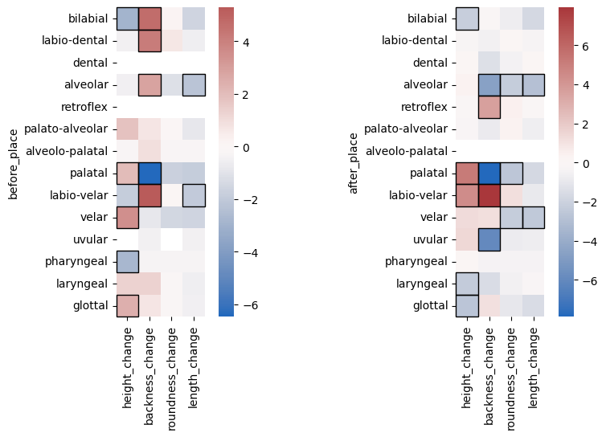
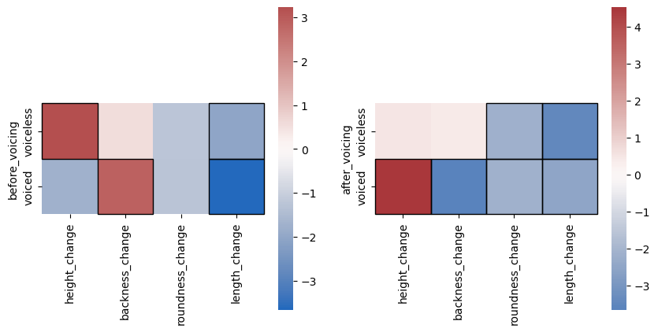
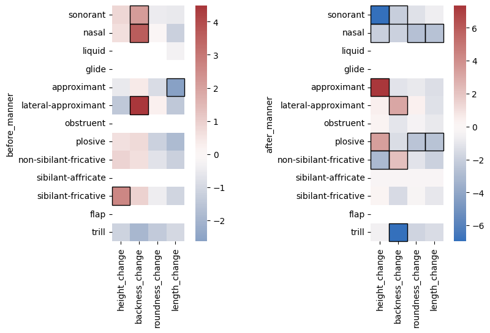

# Analysis of the *Index Diachronica*: Final Report

Wilson Biggs

## Background

My interest in linguistics can probably be traced back to sometime during high school, when I first became interested in "conlanging" -- building "constructed languages". One of the things I wanted to do was build an entire family of languages, with a proto-language that evolved into different branches with different sound changes and developments from that proto-language. This is a pretty common goal within the conlanging community; lots of resources have been built up to assist doing things like that. One of those resources -- and one of the most impressive conlanging resources overall -- is the *Index Diachronica*, a hand-compiled reference index of historical sound changes.

The *Index* was compiled by Galen Buttita from a collection of posts in a thread on the *Zompist Bulletin Board*, a conlanging discussion forum; originally, it was in PDF form, but it was later adapted to the web as the *Searchable Index Diachronica*.

The *Index Diachronica* has a lot of problems. Galen Buttita himself notes that the *Index* is "not an academic source, nor is it perfect -- far from it." The notation it uses can be inconsistent at times, and there are lots of errors -- enough that there's a massive PDF someone's compiled consisting solely of corrections to the *Index*. In addition, there are some dubious inclusions, like changes from Proto-Altaic, a theorized proto-language that has been pretty thoroughly debunked. Despite these issues, it still has a lot of utility; as a basis of analysis, it could potentially give insight into what kinds of sound changes tend to occur in language evolution and what factors influence those sound changes.

## The data

The *Searchable Index Diachronica*, in HTML form, is pretty well-structured. Every branch from a parent language to a daughter language has its own section, ID, and header; every sound change has its own `
` tag with its own ID. The [raw HTML file](./data/sid.html) had some formatting issues that caused BeautifulSoup, the Python HTML parsing library I used, to fail, but after a pass with `htmltidy`, pulling the rules out of [the HTML file](./data/sid-tidy.html) was fairly easy.

In total, the *Index* contains 16496 sound change rules across 702 language branches. These rules' formatting generally follows standard formal phonological rule notation. Take, for example, the simple rule `i → e / _n#`. Here, /i/ is the underlying sound that is changed; the arrow represents that the sound on the left changes to the sound on the right; /e/ is the resulting sound; the slash is shorthand for "in the environment where..."; the underline is the location of the sound that will be changed; the /n/ being after the underline means the environment is "when followed by /n/"; and the hash symbol indicates that the environment is at a word boundary -- here, the end of a word. Sounds are represented by their IPA symbols, except for categories of sounds, like "V" (vowels), "C" (consonants), "N" (nasals), etc.

This is just a simple rule, though. Sometimes, categories can have subscripts; for example, `C₂` can mean "the second consonant in the word". In addition, some rules include additional complexities that serve as shorthand, condensing how many rules need to be written. For example, curly braces indicate an "or" relationship between the sounds inside the braces; e.g. `{i,u} → ∅` means "/i/ or /u/ are deleted." Parentheses indicate an "optional" sound, where the rule applies whether or not that sound is there; e.g. `e(ː)j → i` means "/ej/ and /eːj/ both become /i/". Braces and parentheses can both be nested, further complicating matters.

Finally, rules can also condense multiple related rules into one and have more than just one step; for example, `aː ɔː → ɛː oː → eː ow → ej əw` is essentially two rules -- `aː → ɛː → eː → ej` and `ɔː → oː → ow → əw`.

These are all things that were necessary to account for when parsing the sound change rules. Because of that, as well as the inconsistencies and random extraneous information included in some rules, parsing the data was the majority of the effort in this project.

### Parsing the data

There were essentially two separate data parsing steps in this project. The first was to simply split out the "from" sound, "to" sound, any intermediate steps, and the environment. In addition, any parentheses, curly braces, or combined rules needed to be split into separate rules.

The process for developing the [parsing script](./data_parsing_script.py) began with writing out a simple parser that only handled simple cases. Then, once I knew what I wanted the end data to look like, I [wrote unit tests](./data_parsing_script_test.py) for different cases and built out the parsing script until those test cases passed. From there, things were essentially trial and error. I would run the script on the data, wait for it to crash, see what rule caused it to crash, and then either modify the script to handle whatever crashed it, or (if the rule had an issue that I couldn't handle within the parser) modified the data itself (all modifications were made in [a copy of the tidy HTML file](./data/sid-tidy-with-edits.html).)

Eventually, everything worked, and I was ready to start my analysis.

Later on, I needed to do [more parsing](./vowel_changes.py) to do further analysis. That involved parsing vowel change rules' environments to find the rules' preceding and following consonants, then decomposing the relevant vowels and consonants into their phonological features. I used the `gruut_ipa` library to split the rules into individual phones, and the `ipapy` library to get phonological features from those phones. In addition, I had to fork and modify the `ipapy` library to get it to handle categories (like "C", for "any consonant".) This again required some trial and error, as well as writing some [unit tests](./vowel_changes_test.py), but I eventually got everything parsed.

## Analysis

I had two avenues of analysis I wanted to look into; one simple one, and one that was more complex:

- What are the most common sound changes?
- How are sound changes influenced by their environments?

That second question was too broad, though, so I narrowed it down to specifically:

- How do neighboring consonants affect vowel changes?

### The most common sound changes

While this question seems relatively straightforward, there is some ambiguity in it. What exactly does it mean for two sound changes to be 'the same'? I found that including different environments and intermediate steps essentially had the effect of answering a different question: "What are the most common sound changes *that have no specific environment or intermediate steps*?" This is because environments and intermediate steps are so variable and specific that there is very little overlap between exact environments or intermediate steps across different language families. Because of this, I just stuck to the simpler definition of "the same sound change", including only the 'from' and 'to' sounds.

In addition, it turned out that the *Index* included many sound changes that were copied between different daughter languages -- in essence, one sound change that occurred before certain daughter languages split from each other. I had to include some logic to ensure that those sound changes were only counted once.

#### Results

| from_sound | to_sound | count |
|--|--|--|
| h | ∅ | 46 |
| w | ∅ | 44 |
| ʔ | ∅ | 40 |
| k | ∅ | 37 |
| j | ∅ | 34 |
| e | i | 34 |
| a | e | 32 |
| i | e | 30 |
| u | o | 29 |
| o | u | 29 |

The most obvious thing here is how many deletions there are. This makes sense, since what can be deleted is less limited than, say, "what can become /i/". The most common sound change overall is /h/ being deleted; this also makes sense to me, as it's a pretty "subtle" sound (much like /ʔ/, which is also often deleted), and its deletion even occurs in some dialects of English (e.g. British English "history".) Overall, nothing here is too surprising.

What if deletions are excluded?

| e | i | 34 |
| a | e | 32 |
| i | e | 30 |
| u | o | 29 |
| o | u | 29 |
| ts | s | 27 |
| s | ʃ | 26 |
| ɡ | k | 24 |
| k | ɡ | 23 |
| a | o | 23 |

There's still nothing too surprising here; most of these changes are either simple vowel changes, or changes between consonants that are very similar to each other. /ts/ → /s/ is probably the most interesting thing here, but it's still not very surprising that it's so high.

### How neighboring consonants affect vowel changes

This analysis was a bit more complex to do. First, how do you quantify "how" a sound changes? What I did was assign a number to the values of each vowel feature (e.g. 0 = open, 3 = mid, 6 = close, etc.) and find the difference between each start and end sound to get that feature's "change". I decided to look at preceding and following consonants separately, since I had a good idea of how I could do that and felt it was a good place to start (although, in the future, it'd definitely be worth looking at them together.) I then used statistical t-tests to determine if the 'average changes' in vowels preceded / followed by consonants with different features were significantly different from each other, and in what direction they differed. I also excluded duplicate sound changes shared by daughter languages within the same branch, like before.

To visualize these results, I used a heatmap, with outlined squares signifying statistical significance.

**How to interpret these results:**

- **Height change:** negative = lowering (/u/ → /o/); positive = raising (/o/ → /u/)
- **Backness change:** negative = fronting (/u/ → /i/); positive = backing (/i/ → /u/)
- **Roundness change:** negative = unrounding; positive = rounding
- **Length change:** negative = shortening; positive = lengthening

#### Results

##### Place

Some results here line up with what I expected. First, regarding height, palatal consonants clearly tend to raise the height of vowels nearby, regardless of whether they come before or after the vowel; this is not surprising. However, I'm surprised that velar consonants show a stronger raising effect when preceding vowels than palatal consonants. Additionally, the effects of glottal, laryngeal, and labio-velar consonants on height are odd to me, and I can't really explain why those are the case.

When it comes to backness, the most striking finding here is that labio-velar consonants (essentially just /w/) have a very strong backing effect; this was unsurprising, as /w/ is very similar to /u/ in how it's pronounced. Palatal consonants have the opposite effect, which is also unsurprising. Preceding bilabial or labiodental consonants having a backing effect also makes some sense to me, but that might just because of their similarity with /w/ -- I don't have an explanation more specific than that. However, I can't explain why uvular consonants seem to have a strong fronting effect when following vowels, why retroflex consonants have a backing effect, or why alveolar consonants have a backing effect when preceding, but a raising effect when following.

Additionally, it seems really surprising that bilabial and labio-velar consonants seem to have no association with vowels becoming more rounded. The only significant association is that following palatal, velar, and alveolar consonants seem to have an un-rounding effect.

Finally, many types of consonants seem to be associated with shortening vowel length (most too weak to be statistically significant), but none are associated with lengthening. This leads me to think that consonants may have an inherent shortening effect regardless of their place of articulation.

##### Voicing & Place

There's no obvious explanation that I'm aware of for any of these effects -- it honestly feels totally random. This shows what I think is the biggest weakness of my approach -- it may be that correlations between different features of consonants are confounding the results. For example, most approximants are palatals or labio-velars, both of which seem to have a raising effect after the vowel, which may explain why approximants show such a strong raising effect after the vowel. However, is that raising effect due to them being approximants, or due to them being palatals and labio-velars? From the analysis I've done, it's impossible to say.

### Conclusions

My analysis of the most common sound changes was pretty straightforward, and the results were as well; the most common sound changes are simple sound changes from similar sounds, as well as deletions of common consonants, especially those that are more "subtle", like /h/.

However, the analysis of how neighboring consonants effect vowel changes was a bit of a mess. Some results lined up with what I expected (palatals are associated with fronting, /w/ is associated with backing) but I couldn't explain most results at all. There are a handful of potential reasons for this. The first is the fact that there's really no way to separate the effects of correlated consonant features, making it impossible to really say *what* is causing the observed effects. I tried using linear regression to try and untangle this, but those results were even messier, so I didn't really dig into that further.

In addition, there are a lot of interacting factors that influence sound change; the easiest to explain (and the effects I was unsurprised by) are assimilation effects, but dissimilation is much more sporadic and hard to pin down direct causes for, and that may also be the cause of some of the more confusing effects I observed.

Overall, my results for that second analysis question were a little disappointing. I was hoping I would be able to make some more firm conclusions. However, it definitely leaves me curious why I got the results I did, and whether there is any way to perform this analysis that would give me some firmer results. That's definitely something I want to look into in the future.

## References

- [A People's History of the /Index/](http://galen.conlang.org/id.html) by Galen Buttita
- [Searchable Index Diachronica](https://chridd.nfshost.com/diachronica/) by chri d. d.
